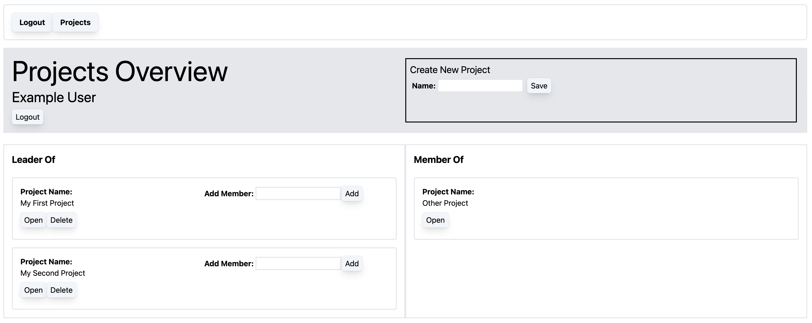

# Project Management Web Application

## Description
A project management app built with PostgreSQL, NestJS, and React. Once 
authenticated, users can create projects and invite other users to the 
project by email. Project leaders and members can create and complete 
tasks for any project they have access to.

Developed as a group, my contributions specifically were:
1. Initial landing page dispalying user information and their projects, 
including both projects they created and projects they've been invited to.
2. Endpoints to obtain project records from database using REST principles
3. Project and Projects React components

## Build Instructions
Find the build instructions for this project 

## Images

